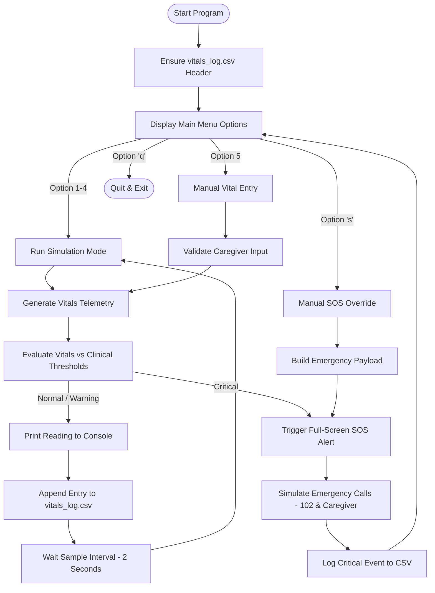
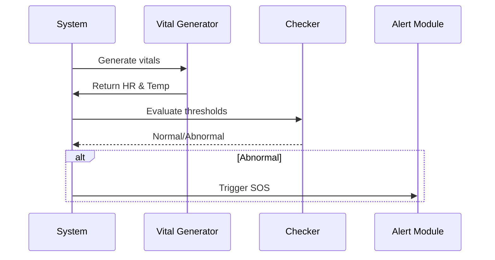

# Elder Health Monitoring & SOS Alert System

## Introduction

Caring for elderly people has become an increasingly important responsibility as families grow smaller and life expectancy continues to rise. Many older adults now live alone, which can leave them vulnerable during sudden medical problems or emergencies when no one is around to help. This project aims to offer a practical and reliable solution through an automated Python-based health monitoring system. It simulates essential vital signs, keeps track of unusual patterns, and triggers an SOS alert when something seems wrong. The goal is to provide elders with an added layer of safety and reassurance, while giving families peace of mind.

---

## Real-World Problem

Many elderly individuals suffer from:

- Heart-related emergencies.
- High fever or infections.
- Low oxygen levels.
- Sudden falls or unconsciousness.
- No immediate caretaker response.

**Major Issue:** Delay in medical attention.

A simple automated system can help reduce risk and save lives.

---

## Objectives

- Simulate heart rate & temperature.
- Detect abnormal health conditions.
- Trigger instant SOS alerts.
- Demonstrate real-time monitoring.
- Offer a beginner-friendly Python model.

---

## Concepts Used (From Coursework)

- **Loops** -- continuous monitoring.
- **Functions** -- modular approach.
- **Conditional statements** -- threshold detection.
- **Random module** -- simulated sensor data.
- **Time module** -- real-time delay.

---

## Tools & Technologies

- **Programming Language**: Python 3.8+
- **Standard Libraries**:
  - `random` — Generates dynamic mock telemetry data across different simulation modes.
  - `time` — Manages sample intervals, delays, and timestamp generation.
  - `csv` — Handles reading and appending structured records to `vitals_log.csv`.
- **Interface**: Interactive, resilient Console-based CLI.
- **Data Persistence**: Local CSV file storage (`vitals_log.csv`).

---

## Problem Definition

Elders need reliable monitoring, but manual supervision isn't practical.

This system automates vital checking and alerts during emergencies.

---

## Requirements Analysis

### Functional Requirements

- Generate heart rate.
- Generate body temperature.
- Compare values with thresholds.
- Display output.
- Trigger SOS alerts.

### Non-Functional Requirements

- Easy to operate.
- Readable.
- Reliable.
- Low resource usage.

---

## Top-Down Design (Modules)

```text
src/
├── main.py             → Entry point; manages user menu, mode routing, and main simulation loop
├── vitals_module.py    → Generates mock vital signs and evaluates them against health thresholds
├── alert_module.py     → Triggers full-screen SOS emergency alerts and handles contact notifications
├── logging_module.py   → Ensures CSV initialization and persists timestamped reading history
└── vitals_log.csv      → Local storage file for health log history and critical event logs
```

---

## Step-Wise Algorithm

1. **Start**: Initialize the program and ensure the CSV log file (`vitals_log.csv`) exists with proper headers.
2. **Display Main Menu**: Present interactive execution options (`Simulation Modes`, `Manual Vital Input`, `Manual SOS`, `Quit`).
3. **Capture Vitals Data**: Obtain Heart Rate, Temperature, and SpO2 readings via the chosen mode (auto-generated in continuous simulation or manually entered by the user).
4. **Validate & Check Thresholds**: Evaluate the vital parameters against configured clinical thresholds to assign a status (`Normal`, `Warning`, or `Critical`).
5. **Print & Log Data**: Output the formatted reading with timestamp to the console and append the record to `vitals_log.csv`.
6. **Evaluate Status**:
   - **If Critical**: Trigger the full-screen SOS alert display, simulate emergency contact notifications, log the event, wait 2 seconds, and return to the main menu.
   - **If Normal / Warning**: Pause for 2 seconds (the default sample interval) and continue the monitoring loop.
7. **Repeat or Exit**: Loop continuously until the user interrupts the execution (`Ctrl+C`) or selects the `Quit` menu option.

---

## Flowchart



---

## Testing & Refinement

- Tested multiple random ranges.
- Verified threshold accuracy.
- Continuous loop stability.
- Improved warnings & readability.

---

## Features

- Real-time simulation.
- Automated health checks.
- Beginner-friendly.
- Clean and modular code.

---

## Detailed Workflow



---

## Folder Structure

```text
project/
│── project_report/     # Academic report documentation & VITyarthi formats
│── screenshots/        # High-contrast visual assets, flowcharts, & test matrices
│── README.md           # Comprehensive project overview & documentation
└── src/                # Primary Python source code
    ├── alert_module.py     # SOS emergency alert dispatch engine
    ├── logging_module.py   # CSV file persistence and log management
    ├── main.py             # Application entry point & interactive menu loop
    ├── vitals_log.csv      # Local storage file for health log history
    └── vitals_module.py    # Mock vital generator & clinical threshold evaluator
```

---

## How to Operate the Program

### Step 1 -- Download or Clone the GitHub Repository

### Step 2 -- Open the Project Folder

### Step 3 -- Go to the `src` Directory

### Step 4 -- Run the Program

```bash
python main.py
```

### Step 5 -- Observe Real-Time Monitoring

You will see:

- Heart rate
- Temperature
- Status (Normal / Warning / SOS)

### Step 6 -- SOS Alerts

Displayed when vitals cross thresholds.

### Step 7 -- Stop the Program Manually (`Ctrl + C`)

---

## Future Enhancements

- Add oxygen monitoring.
- Integrate real sensors.
- SMS/Call API.
- Mobile app.
- Cloud database.

---

## Real-World Applications

Useful for:

- Elders living alone.
- Remote patient care.
- Home health IoT.
- Hospitals.
- Wearable devices.

---

## Importance for Students

Students learn:

- Use of basics of Python to build real projects.
- Real-world coding.
- Modular design.
- IoT basics.
- Proper documentation.

---

## Conclusion

The Elder Health Monitoring & SOS Alert System demonstrates how simple Python concepts can solve meaningful real-world problems.

By simulating vitals and detecting abnormalities, the system provides automated, continuous monitoring for elders, helping prevent medical delays.

This foundational model is highly expandable for IoT health technologies and real sensor integration.
